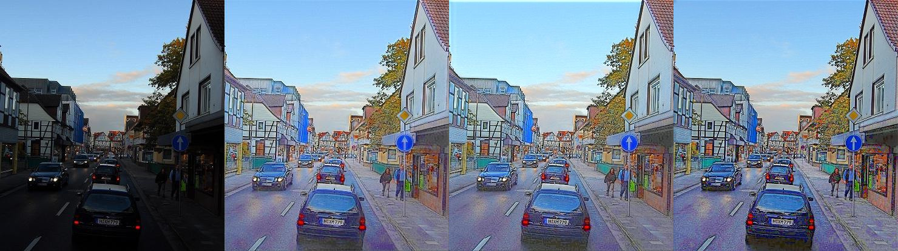
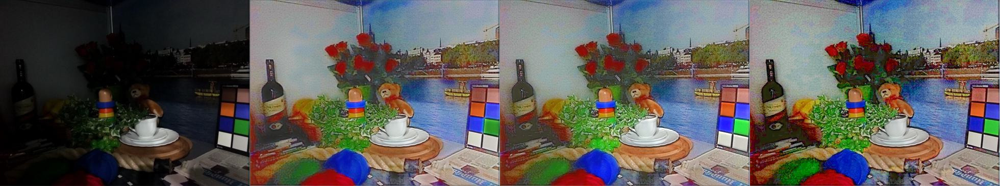

# Deep Retinex Decomposition for Low-Light Enhancement, BMVC'18 (Unofficial PyTorch Code)
Unofficial PyTorch code for the paper - Deep Retinex Decomposition for Low-Light Enhancement, BMVC'18 (Oral), Chen Wei, Wenjing Wang, Wenhan Yang, and Jiaying Liu

The offical Tensorflow code is available [here](https://github.com/weichen582/RetinexNet). 

Please ensure that you cite the paper if you use this code:
```
@inproceedings{Chen2018Retinex,
 title={Deep Retinex Decomposition for Low-Light Enhancement},
 author={Chen Wei, Wenjing Wang, Wenhan Yang, Jiaying Liu},
 booktitle={British Machine Vision Conference},
 year={2018},
 organization={British Machine Vision Association}
}
```
### Requirements
The code is tested on Python 3.7, PyTorch 1.1.0, TorchVision 0.3.0, but lower versions are also likely to work. During training on a single NVidia GTX1080 GPU, keeping a batch-size of 16 and image patches of resolution 96x96, the memory consumption was found to be around 2.5GB. The training time is under an hour. 

### Training
Please download the training and testing datasets from [here](https://daooshee.github.io/BMVC2018website/). Ensure you arrange the data by keeping training pairs of the LOL dataset under `<PATH-TO-TRAIN-DIR>/data/our485/`, and synthetic pairs under `<PATH-TO-TRAIN-DIR>/data/syn/`. You can then run-
```
$ python train.py \
--data_dir <PATH-TO-TRAIN-DIR> \
```
### Testing
For sample testing/prediction, you can run-
```
$ python predict.py
```
There is a pre-trained checkpoint available in the repo. You may use it for sample testing or create your own after training as needed. The results are generated (by default) for the data present in `./data/test/low/` folder, and the results are saved (by default) in `./results/test/low/` folder. 

### Comparison
Input, Output (This Code), Output (Official Tensorflow, After Training from Scratch), Output (Official Tensorflow, Pre-trained Checkpoint)

Image: 1 (`./data/test/low/1.bmp`)


Image: 2 (`./data/test/low/2.bmp`)


Image: 3 (`./data/test/low/3.bmp`)
  

Please feel free to report any improvements or bugs present in the code.
